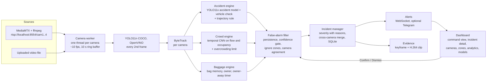

# Drishti - Real-Time AI for Public Safety

Team HCQ_D36 · HackConquest, Aether 2026, TCET Mumbai · Problem statement PS 06

Drishti watches simulated public CCTV feeds and raises three kinds of incident in real
time: traffic accidents, crowd anomalies and unattended baggage. Every incident carries a
severity score with the reasons spelled out, an evidence clip, and the cameras that saw it.
An operator confirms or dismisses incidents from one dashboard, and those decisions tune
the false-alarm filter.

Status, run commands and known gaps for whoever picks this up next: **STATUS.md**.

## How it works



Learned models do the detecting: a COCO detector, a fine-tuned accident detector, and a
crowd model we trained. Rules sit on top as the explainable layer (owner-away timing,
persistence, severity) and as fallbacks when a model is missing.

## PS 06 requirement to component

| PS 06 asks for | Where it lives |
|---|---|
| Simulated public CCTV feeds | `scripts/simulate_rtsp.ps1`: MediaMTX serves four looping clips as real RTSP streams |
| Detect traffic accidents | `backend/app/engines/accident.py` |
| Detect crowd anomalies | `backend/app/engines/crowd.py`, model from `training/train_crowd.py` |
| Detect unattended baggage | `backend/app/engines/baggage.py` |
| Real time | per-camera workers in `backend/app/runtime.py`; measured FPS in BENCH.md and on the Analytics page |
| Multi-camera event tracking | cross-camera merge in `backend/app/intel/incidents.py`: same type, same area, within 30 s |
| Severity-based classification | `backend/app/intel/severity.py`: Critical / High / Medium / Low with a reason for every point |
| False-alarm reduction | `backend/app/intel/filter.py`; with-and-without numbers in BENCH.md |
| Automated emergency alerts | WebSocket push to the dashboard, sound on Critical, optional Telegram (`backend/app/alerts.py`) |
| Centralised dashboard, live visualisation | `frontend/`: camera wall with overlays, incident queue, incident detail |
| Response prioritisation | queue sorted by severity score; J / K / C / D keyboard triage |

## Setup (Windows, PowerShell)

Requirements: Python 3.13, Node 24, Google Chrome. No GPU needed.

```powershell
# 1. Python environment (pinned)
python -m venv backend\.venv
backend\.venv\Scripts\python -m pip install torch torchvision --index-url https://download.pytorch.org/whl/cpu
backend\.venv\Scripts\python -m pip install -r backend\requirements.txt

# 2. Dashboard
cd frontend; npm ci; npm run build; cd ..

# 3. Tools (not in git): unzip into tools\
#    ffmpeg 9.0.2 essentials  -> tools\ffmpeg\bin\ffmpeg.exe
#    MediaMTX v1.21.1 windows -> tools\mediamtx\mediamtx.exe

# 4. Models (not in git)
#    models\accident.pt : weights\epoch61.pt from huggingface.co/Enos-123/traffic-accident-detection-yolo11x
backend\.venv\Scripts\python training\export_models.py      # downloads YOLO11n, exports OpenVINO
backend\.venv\Scripts\python training\train_crowd.py        # trains models\crowd_tcn.pt (needs data\bench\crowd)

# 5. Demo clips and cache (needs data\bench, see BENCH.md for the sources)
backend\.venv\Scripts\python training\prepare_demo.py
```

On the machine this was built on, all five steps are already done.

## Run

```powershell
# Live: RTSP simulation + real inference + dashboard in Chrome
powershell -ExecutionPolicy Bypass -File scripts\start.ps1

# Demo mode: cached detections, no YOLO inference, no network
powershell -ExecutionPolicy Bypass -File scripts\demo.ps1

# Stop either
powershell -ExecutionPolicy Bypass -File scripts\stop.ps1
```

The dashboard is at http://localhost:8000. To add your own source, open Cameras and paste
an RTSP URL or drop a video file.

Tests: `cd backend; .venv\Scripts\python -m pytest tests -q`

## Measured results

All numbers are in **BENCH.md** and on the dashboard's Models page, each with its dataset
and clip count. They come from `docs/results/*.json`, written by scripts in `training/`.
Nothing in the dashboard or the docs is estimated.

<!-- RESULTS:START -->
**Our crowd model (temporal CNN)**

_UMN Unusual Crowd Activity (University of Minnesota)_

| Metric | Value | Detail |
|---|---:|---|
| Frame-level AUC, held-out scenes | 0.9901 | scenes [1, 4, 7, 9], 908 windows, 174 abnormal |
| Frame-level AUC, training scenes | 1.0 | scenes [0, 2, 3, 5, 6, 8, 10], 1495 windows |
| Precision at 0.5, held-out | 0.926 | n/a |
| Recall at 0.5, held-out | 0.931 | n/a |
| Baseline AUC: flow magnitude alone | 0.5691 | same held-out windows |
| Baseline AUC: fastest person alone | 0.6056 | same held-out windows |

temporal CNN (2 x Conv1d, 24 channels) over a 1.6 s window of 8 per-frame features. Split by scene. UMN is staged (people told to run). Expect weaker numbers on real CCTV.

**End to end: whole pipeline on the bench set**

_generated 2026-09-30 21:03_

| Task | Footage | Detected | Median delay (s) | Alarms before onset |
|---|---|---:|---:|---:|
| Accident | UCF-Crime RoadAccidents, first 8 annotated test videos, first 40 s of each | 1 / 8 | 1.3 | 4 |
| Crowd anomaly, all scenes | UMN, 11 scenes (4 held out from training) | 10 / 11 | 1.1 | 0 |
| Crowd anomaly, held-out scenes only | UMN scenes 1, 4, 7, 9 | 4 / 4 | n/a | n/a |
| Unattended baggage | ABODA videos 1, 2, 3, 4, 9, 10 | 3 / 6 | n/a | n/a |

Same settings as the live system. Accident window: 1 s before onset to 10 s after the annotated end. ABODA has no onset labels, so baggage has no delay figure.

**False alarms, with and without our filter**

_UCF-Crime Testing_Normal videos 006, 015, 018, 024, first 40 s of each_

| Footage | Camera-seconds | Alarms without filter | Alarms with filter | Per camera-hour, without | Per camera-hour, with |
|---|---:|---:|---:|---:|---:|
| Normal clips (4) | 105.9 | 4 | 1 | 136.0 | 34.0 |
| All bench footage (incident clips included) | n/a | 32 | 21 | n/a | n/a |

Without filter = every candidate group an engine produced. With filter = incidents raised after persistence, confidence gate and zone checks (groups that passed = total minus suppressed). The normal set is under 3 minutes of footage, so the per-hour rates are rough. Crowd persistence was lowered from 2 s to 1 s after a first run of this evaluation showed it suppressing real dispersals, so the crowd figures here are not from untouched settings.
<!-- RESULTS:END -->

## Limitations (read before the pitch)

- **Small evaluation set.** 8 accident clips, 6 baggage clips, 11 crowd scenes, 4 normal
  clips. Enough to compare options and catch regressions, not enough to claim an accuracy.
- **Accident detection is the weakest part.** Both accident models we benched miss most
  low-resolution UCF-Crime accidents. See BENCH.md for the exact counts.
- **The accident model is slow on a laptop CPU.** It is a YOLO11x and takes over a second
  per frame here, so it runs on a side thread and live accident alerts lag by a few
  seconds. Demo mode replays detections computed offline, so it does not show that lag.
- **Bag detection limits baggage.** COCO weights often do not see a parked bag on ABODA.
  The owner logic is tested; the detector feeding it needs the luggage fine-tune.
- **The crowd model is trained on staged footage** (UMN, people told to run) in three
  locations. It will need real CCTV data before anyone should trust it elsewhere.
- **cam2 is not a real second camera.** It is cam1's clip mirrored and cropped, to show
  cross-camera merging. Merging is by area name and time, not by geometry or re-ID.
- **Vision-model verification and Telegram are built but never ran against the live
  services**, because no keys were available. They are off by default.
- **No authentication** on the dashboard or API. Run it on a trusted machine only.

## Credits and licences

See CREDITS.md. This project uses Ultralytics YOLO, which is **AGPL-3.0**, so the project
as a whole has to be shared under AGPL-3.0-compatible terms. The accident weights are MIT.
Several repos we studied have no licence; nothing from them is copied or shipped
(DISCOVERY.md, docs/WHAT_WE_BUILT.md).
