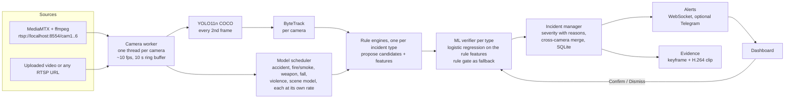

# Drishti - Real-Time AI for Public Safety

Team HCQ_D36 · HackConquest, Aether 2026, TCET Mumbai · Problem statement PS 06

Drishti watches public CCTV feeds and raises incidents in real time across nine families:
traffic accidents, fire and smoke (including explosions), weapons, fights and robberies,
people who have fallen or collapsed, crowd anomalies, unattended baggage, hazards such as
flooding, vandalism or animals on the road, and security events (intrusion, loitering,
wrong-way driving, stalled vehicles, pedestrians on the road). Every camera runs every
detector.

Each incident carries a severity score with the reasons spelled out, an evidence clip, the
cameras that saw it, and, where one is trained, the verdict of an ML verifier with the
features that drove it. An operator confirms or dismisses incidents from one dashboard, and
those decisions tune the thresholds.

Status, run commands and known gaps for whoever picks this up next: **STATUS.md**.

## How it works



Three layers, on purpose:

1. **Models detect.** COCO people/vehicles/bags, a YOLO11x accident detector, a fire and
   smoke detector, a weapon detector, a fall detector, a violence classifier, a zero-shot
   scene model (SigLIP) for the long tail, and a crowd model we trained.
2. **Rules propose.** One engine per incident type turns detections into candidates with
   readable logic (a weapon held by a person, a fight needs two people, a bag whose owner
   walked away, a vehicle against the lane's usual direction) and records features.
3. **An ML verifier decides.** Per incident type, a logistic regression trained on labelled
   UCF-Crime footage takes the rule features and gives the probability the event is real.
   Its per-feature contributions are shown on the incident page. Types without enough
   labelled data fall back to the rule gate, and the incident page says so.

## Incident types

| Family | Subtypes | Detected by | Decided by |
|---|---|---|---|
| Traffic | accident / collision | YOLO11x accident model + vehicle check + trajectory rule | ML verifier where trained (Models page), else rule gate |
| Fire & hazards | fire, smoke, explosion | fire/smoke YOLOv8n + scene model | ML verifier where trained, else rule gate |
| | flooding, vandalism, animal on the road | scene model (zero-shot) | rule gate (vandalism verifier where trained) |
| Violence & weapons | fight / assault, robbery | violence classifier + people rules + scene model | ML verifier where trained, else rule gate |
| | gun, knife | weapon detector + "held by a person" rule | ML verifier where trained, else rule gate |
| Crowd & medical | sudden dispersal, overcrowding | crowd temporal CNN + count rule | rule gate (the crowd detector is itself a trained model) |
| | fall, collapse | fall detector + lying-still rule | rule gate (no labelled fall video) |
| Security & objects | unattended / abandoned baggage | COCO bags + owner-away logic | rule gate |
| | intrusion, loitering, wrong-way driving, stalled vehicle, pedestrian on road | tracks + zones drawn in the dashboard | rule gate |

## PS 06 requirement to component

| PS 06 asks for | Where it lives |
|---|---|
| Simulated public CCTV feeds | `scripts/simulate_rtsp.*`: MediaMTX serves six looping clips as real RTSP streams |
| Detect traffic accidents | `backend/app/engines/accident.py` |
| Detect crowd anomalies | `backend/app/engines/crowd.py`, model from `training/train_crowd.py` |
| Detect unattended baggage | `backend/app/engines/baggage.py` |
| (beyond PS 06) fire, weapons, violence, falls, hazards, security | `backend/app/engines/extra.py`, models in `backend/app/aux_models.py` |
| Real time | per-camera workers and a model scheduler (`backend/app/runtime.py`, `backend/app/aux_models.py`) |
| Multi-camera event tracking | cross-camera merge in `backend/app/intel/incidents.py`: same type, same area, within 30 s |
| Severity-based classification | `backend/app/intel/severity.py`: Critical / High / Medium / Low with a reason for every point |
| False-alarm reduction | `backend/app/intel/filter.py` + `backend/app/intel/verifier.py`; numbers in BENCH.md |
| Automated emergency alerts | WebSocket push to the dashboard, sound on Critical, optional Telegram (`backend/app/alerts.py`) |
| Centralised dashboard, live visualisation | `frontend/`: camera wall with overlays, incident queue, incident detail |
| Response prioritisation | queue sorted by severity score; J / K / C / D keyboard triage |

## Run on macOS (Apple silicon, e.g. M5)

Copy the whole project folder (including `models/` and `data/demo/`) to the Mac, then:

```bash
bash scripts/setup_mac.sh          # once: Python venv, ffmpeg, MediaMTX, dashboard build
bash scripts/demo.sh               # demo mode: 6 cameras replayed from cache
bash scripts/start.sh              # live: 1 simulated RTSP camera, every model, Apple GPU
CAMS=6 bash scripts/start.sh       # live with all six simulated cameras
bash scripts/stop.sh
```

On the Mac every model runs on the Apple GPU (PyTorch `mps`) automatically; set
`DRISHTI_DEVICE=cpu` to force the CPU. If `models/` was not copied, `setup_mac.sh` downloads
the public weights; the two models trained here (`crowd_tcn.pt`, `verifiers.json`) must be
copied or retrained (`training/train_crowd.py`, `training/train_verifiers.py`).
These scripts were written on Windows and have not been run on a Mac yet.

## Setup (Windows, PowerShell)

Requirements: Python 3.13, Node 24, Google Chrome. No GPU needed.

```powershell
# 1. Python environment (pinned)
python -m venv backend\.venv
backend\.venv\Scripts\python -m pip install torch torchvision --index-url https://download.pytorch.org/whl/cpu
backend\.venv\Scripts\python -m pip install -r backend\requirements.txt

# 2. Dashboard
cd frontend; npm ci; npm run build; cd ..

# 3. Tools (not in git): unzip into tools\
#    ffmpeg 9.0.2 essentials  -> tools\ffmpeg\bin\ffmpeg.exe
#    MediaMTX v1.21.1 windows -> tools\mediamtx\mediamtx.exe

# 4. Models (not in git)
backend\.venv\Scripts\python training\get_models.py         # every public weight, pinned revisions
backend\.venv\Scripts\python training\export_models.py      # YOLO11n to OpenVINO (faster on Intel CPUs)
backend\.venv\Scripts\python training\train_crowd.py        # trains models\crowd_tcn.pt (needs data\bench\crowd)
backend\.venv\Scripts\python training\extract_features.py   # runs every model over the labelled clips
backend\.venv\Scripts\python training\train_verifiers.py    # trains models\verifiers.json

# 5. Demo clips and cache (needs data\bench, see BENCH.md for the sources)
backend\.venv\Scripts\python training\prepare_demo.py
```

On the machine this was built on, all five steps are already done.

## Run (Windows)

```powershell
# Live: RTSP simulation + every model + dashboard in Chrome (-Cams 6 for all six cameras)
powershell -ExecutionPolicy Bypass -File scripts\start.ps1

# Demo mode: cached detections, no model inference, no network
powershell -ExecutionPolicy Bypass -File scripts\demo.ps1

# Stop either
powershell -ExecutionPolicy Bypass -File scripts\stop.ps1
```

The dashboard is at http://localhost:8000. To add your own source, open Cameras and paste
an RTSP URL or drop a video file.

Tests: `cd backend; .venv\Scripts\python -m pytest tests -q`

## Measured results

All numbers are in **BENCH.md** and on the dashboard's Models page, each with its dataset
and clip count. They come from `docs/results/*.json`, written by scripts in `training/`.
Nothing in the dashboard or the docs is estimated.

<!-- RESULTS:START -->
**Our crowd model (temporal CNN)**

_UMN Unusual Crowd Activity (University of Minnesota)_

| Metric | Value | Detail |
|---|---:|---|
| Frame-level AUC, held-out scenes | 0.9901 | scenes [1, 4, 7, 9], 908 windows, 174 abnormal |
| Frame-level AUC, training scenes | 1.0 | scenes [0, 2, 3, 5, 6, 8, 10], 1495 windows |
| Precision at 0.5, held-out | 0.926 | n/a |
| Recall at 0.5, held-out | 0.931 | n/a |
| Baseline AUC: flow magnitude alone | 0.5691 | same held-out windows |
| Baseline AUC: fastest person alone | 0.6056 | same held-out windows |

temporal CNN (2 x Conv1d, 24 channels) over a 1.6 s window of 8 per-frame features. Split by scene. UMN is staged (people told to run). Expect weaker numbers on real CCTV.

**End to end: whole pipeline on the bench set**

_generated 2026-09-30 21:03_

| Task | Footage | Detected | Median delay (s) | Alarms before onset |
|---|---|---:|---:|---:|
| Accident | UCF-Crime RoadAccidents, first 8 annotated test videos, first 40 s of each | 1 / 8 | 1.3 | 4 |
| Crowd anomaly, all scenes | UMN, 11 scenes (4 held out from training) | 10 / 11 | 1.1 | 0 |
| Crowd anomaly, held-out scenes only | UMN scenes 1, 4, 7, 9 | 4 / 4 | n/a | n/a |
| Unattended baggage | ABODA videos 1, 2, 3, 4, 9, 10 | 3 / 6 | n/a | n/a |

Same settings as the live system. Accident window: 1 s before onset to 10 s after the annotated end. ABODA has no onset labels, so baggage has no delay figure.

**False alarms, with and without our filter**

_UCF-Crime Testing_Normal videos 006, 015, 018, 024, first 40 s of each_

| Footage | Camera-seconds | Alarms without filter | Alarms with filter | Per camera-hour, without | Per camera-hour, with |
|---|---:|---:|---:|---:|---:|
| Normal clips (4) | 105.9 | 4 | 1 | 136.0 | 34.0 |
| All bench footage (incident clips included) | n/a | 32 | 21 | n/a | n/a |

Without filter = every candidate group an engine produced. With filter = incidents raised after persistence, confidence gate and zone checks (groups that passed = total minus suppressed). The normal set is under 3 minutes of footage, so the per-hour rates are rough. Crowd persistence was lowered from 2 s to 1 s after a first run of this evaluation showed it suppressing real dispersals, so the crowd figures here are not from untouched settings.
<!-- RESULTS:END -->

## Limitations (read before the pitch)

- **Small evaluation set.** 8 accident clips, 6 baggage clips, 11 crowd scenes, 4 normal
  clips. Enough to compare options and catch regressions, not enough to claim an accuracy.
- **Accident detection is the weakest part.** Both accident models we benched miss most
  low-resolution UCF-Crime accidents. See BENCH.md for the exact counts.
- **The accident model is slow on a laptop CPU.** It is a YOLO11x and takes over a second
  per frame here, so it runs on a side thread and live accident alerts lag by a few
  seconds. Demo mode replays detections computed offline, so it does not show that lag.
- **Bag detection limits baggage.** COCO weights often do not see a parked bag on ABODA.
  The owner logic is tested; the detector feeding it needs the luggage fine-tune.
- **The crowd model is trained on staged footage** (UMN, people told to run) in three
  locations. It will need real CCTV data before anyone should trust it elsewhere.
- **cam2 is not a real second camera.** It is cam1's clip mirrored and cropped, to show
  cross-camera merging. Merging is by area name and time, not by geometry or re-ID.
- **Vision-model verification and Telegram are built but never ran against the live
  services**, because no keys were available. They are off by default.
- **No authentication** on the dashboard or API. Run it on a trusted machine only.

## Credits and licences

See CREDITS.md. This project uses Ultralytics YOLO, which is **AGPL-3.0**, so the project
as a whole has to be shared under AGPL-3.0-compatible terms. The accident weights are MIT.
Several repos we studied have no licence; nothing from them is copied or shipped
(DISCOVERY.md, docs/WHAT_WE_BUILT.md).
